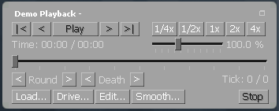

# Запись и просмотр POV demo в CS:GO

<br>

**POV демо** — это запись игры участника от первого лица (действия игрока и всё что он видит).

Демо нужно записывать в каждом матче. **Отсутствие демо влечет за собой невыплату призовых.**

Чтобы записать демо в CS:GO необходимо во время игры открыть консоль клавишей **(~)**, она находится возле клавиши **Esc**.  
Если консоль не открывается, то она отключена в настройках игры, открой настройки игры и выбери «Да» напротив «Включить консоль разработчика (~)».  
Далее в открывшемся окне консоли набрать команду (где **NAME** — любое имя демо):

`record NAME`

Чтобы остановить запись демо в консоли набери команду:

`stop`

Файл с демо будет сохранен в папку с CS:GO, например:

```
C:\Program Files\Steam\steamapps\common\Counter-Strike Global Offensive\csgo\NAME.dem
```

В эту же папку перемести чужие демо.  
Для просмотра демо нужно открыть проигрыватель, для этого в консоли набери команду:

``demoui``

Или:

`demoui2`

Либо нажми комбинацию клавиш **Shift + F2**.  
Далее в открывшемся плеере нажми «Load…» и выбери демо.  
Во время просмотра можно:

*   Переключаться между игроками клавишами **влево/вправо**;
*   **CTRL** — откроет карту;
*   **Пробел** переключит камеру в режим свободного полета.



